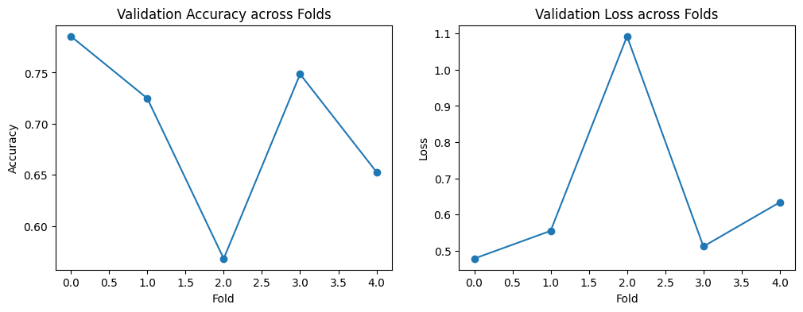
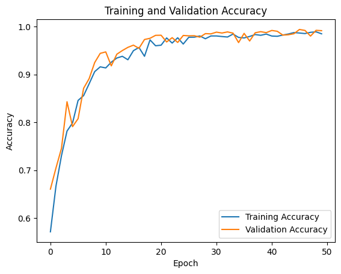
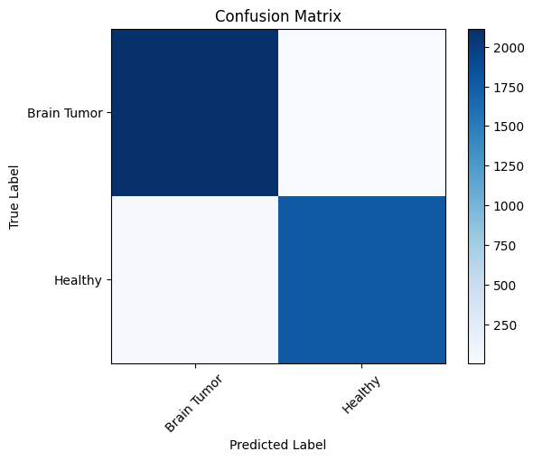
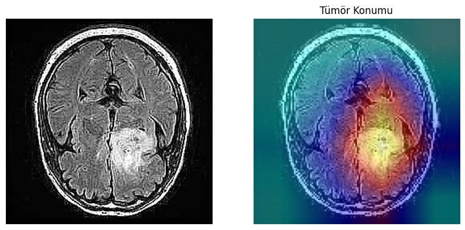

# Brain Tumor Detection

[](https://opensource.org/licenses/MIT)
[](https://www.python.org/downloads/release/python-370/)

This repository contains a deep learning project aimed at detecting brain tumors from MRI images. The project implements a Convolutional Neural Network (CNN) for classification and utilizes Grad-CAM for visualizing the tumor regions. Additionally, a pre-trained VGG16 model is used to enhance predictions and interpretability.

## Table of Contents

1. [Project Overview](#project-overview)
2. [Features](#features)
3. [Installation](#installation)
4. [Dataset Preparation](#dataset-preparation)
5. [Training the Model](#training-the-model)
6. [Making Predictions](#making-predictions)
7. [Visualizing Tumor Regions](#visualizing-tumor-regions)
8. [Evaluation Metrics](#evaluation-metrics)
9. [Results](#results)
10. [Future Work](#future-work)
11. [Contributing](#contributing)

## Project Overview

### Objective

The primary objective of this project is to develop a reliable and efficient system to detect brain tumors from MRI images. It leverages deep learning techniques to classify the images into **"Cancer"** and **"Healthy"** categories and visualizes the affected areas when a tumor is detected.

### Motivation

Detecting brain tumors at an early stage is crucial for effective treatment. Manual interpretation of MRI scans by radiologists can be time-consuming and prone to human error. This project aims to assist medical professionals by providing an automated solution that can improve diagnostic accuracy and speed.

### Methodology

The project is divided into several components:

1. **Data Augmentation and Preprocessing**: Utilizes image data augmentation techniques to enhance the training dataset.
2. **CNN Architecture**: Implements a custom CNN model with multiple convolutional and pooling layers to classify MRI images.
3. **Grad-CAM Visualization**: Employs Grad-CAM to generate heatmaps highlighting the tumor regions, aiding in interpretability.
4. **VGG16 Integration**: Incorporates a pre-trained VGG16 model for improved prediction accuracy and feature extraction.

## Features

- **Efficient CNN Model**: A custom CNN model optimized for brain tumor detection.
- **Data Augmentation**: Enhances the training dataset to improve model generalization.
- **Grad-CAM Visualization**: Provides visual explanations for model predictions.
- **Pre-trained VGG16**: Utilizes transfer learning for enhanced performance.
- **Comprehensive Evaluation**: Includes metrics such as accuracy, precision, recall, and F1-score.

## Installation

### Prerequisites

Before running the code, ensure that you have the following software and libraries installed:

- Python 3.7 or later
- TensorFlow 2.0 or later
- Keras
- OpenCV
- scikit-learn
- Matplotlib
- NumPy

### Setting Up the Environment

Clone the repository:

```bash
git clone https://github.com/yourusername/brain-tumor-detection.git
cd brain-tumor-detection
```

Install the required Python packages:

```bash
pip install -r requirements.txt
```

### Google Colab

If you are using Google Colab, ensure you have access to your Google Drive, where the dataset is stored. Use the following code snippet to mount your drive:

```python
from google.colab import drive
drive.mount('/content/drive')
```

## Dataset Preparation

### Dataset Structure

The dataset should be organized in the following directory structure:

```plaintext
/content/train_data/Training Data Set
    ├── Brain Tumor
    │   ├── tumor1.jpg
    │   ├── tumor2.jpg
    │   └── ...
    └── Healthy
        ├── healthy1.jpg
        ├── healthy2.jpg
        └── ...

/content/prediction_data/Prediction Data Set
    ├── test_image1.jpg
    ├── test_image2.jpg
    └── ...
```

### Data Augmentation

Data augmentation techniques such as rescaling, shearing, zooming, and horizontal flipping are applied to enhance the training dataset. This improves the model's ability to generalize to unseen data.

### Unzipping the Dataset

Ensure that the dataset zip files are uploaded to your Google Drive. Update the paths in the script to reflect the correct locations of your training and prediction datasets:

```python
# Getting zip file from drive for training dataset
zip_path = '/content/drive/MyDrive/Training Data Set.zip'
extract_path = '/content/train_data'
with zipfile.ZipFile(zip_path, 'r') as zip_ref:
    zip_ref.extractall(extract_path)

# Getting zip file from drive for prediction dataset
zip_path2 = '/content/drive/MyDrive/Prediction Data Set.zip'
extract_path2 = '/content/prediction_data'
with zipfile.ZipFile(zip_path2, 'r') as zip_ref:
    zip_ref.extractall(extract_path2)
```

## Training the Model

The CNN model is defined with multiple convolutional layers, pooling layers, and dense layers. It is compiled with the Adam optimizer and categorical cross-entropy loss function.

### Model Architecture

Here's a summary of the CNN architecture:

- **Convolutional Layer 1**: 32 filters, (3x3) kernel, ReLU activation
- **Max Pooling Layer 1**: (2x2) pool size
- **Convolutional Layer 2**: 64 filters, (3x3) kernel, ReLU activation
- **Max Pooling Layer 2**: (2x2) pool size
- **Convolutional Layer 3**: 128 filters, (3x3) kernel, ReLU activation
- **Max Pooling Layer 3**: (2x2) pool size
- **Convolutional Layer 4**: 256 filters, (3x3) kernel, ReLU activation
- **Max Pooling Layer 4**: (2x2) pool size
- **Convolutional Layer 5**: 512 filters, (3x3) kernel, ReLU activation
- **Max Pooling Layer 5**: (2x2) pool size
- **Flatten Layer**: Flattens the input
- **Dense Layer 1**: 1024 neurons, ReLU activation
- **Output Layer**: 2 neurons, Softmax activation

### Training Process

To train the model, run the following script:

```python
# Train the model
epochs = 50
history = model.fit(
    train_generator,
    steps_per_epoch=train_generator.samples // batch_size,
    epochs=epochs,
    validation_data=validation_generator,
    validation_steps=validation_generator.samples // batch_size
)
```

The model is trained for 50 epochs with a batch size of 64. You can adjust these parameters according to your needs.

## Making Predictions

After training, the model can be used to make predictions on new images. The `predict_tumor` function takes an image path as input and outputs the prediction.

### Prediction Function

```python
def predict_tumor(image_path):
    img = load_img(image_path, target_size=(img_width, img_height))
    x = img_to_array(img)
    x = x / 255.0  # Normalize image
    x = np.expand_dims(x, axis=0)

    prediction = loaded_model.predict(x)
    class_index = np.argmax(prediction[0])

    if class_index == 1:
        return "Healthy"
    else:
        return "Cancer"
```

### Predicting New Images

To make predictions on a new set of images, use the following script:

```python
# Predict and print the result
folder_path = '/content/prediction_data/Prediction Data Set'

count = 0
# Determining real result from the file name
for i in range(100):
    image_path = select_random_image(folder_path)
    prediction = predict_tumor(image_path)

    real_result = "Healthy" if "Not Cancer" in image_path else "Cancer"

    print(f"File Path: {image_path}")
    print(f"Real Result: {real_result}")
    print(f"Model Prediction: {prediction}")

    if real_result == prediction:
        count += 1

print(f"Correct Predictions: {count}/100")
```

This code selects random images from the prediction dataset, predicts the class, and compares it with the actual label based on the file name. It also provides a summary of the model's performance on the prediction dataset.

## Visualizing Tumor Regions

Grad-CAM (Gradient-weighted Class Activation Mapping) is used to create a heatmap that highlights the regions of the image that the CNN focuses on when making a prediction. This helps in understanding and interpreting the model's decisions.

### Grad-CAM Function

```python
def grad_cam(image_path, model, layer_name):
    img = load_img(image_path, target_size=(img_width, img_height))
    img = np.array(img)

    x = img_to_array(img)
    x = x / 255.0
    x = np.expand_dims(x, axis=0)

    # Model output and last convolutional layer output
    grad_model = Model(inputs=model.inputs, outputs=[model.get_layer(layer_name).output, model.output])
    with tf.GradientTape() as tape:
        conv_outputs, predictions = grad_model(x)
        loss = predictions[:, np.argmax(predictions[0])]
    grads = tape.gradient(loss, conv_outputs

)[0]

    # Mean intensity of the gradient over each feature map channel
    pooled_grads = tf.reduce_mean(grads, axis=(0, 1, 2))
    heatmap = conv_outputs[0] @ pooled_grads[..., tf.newaxis]
    heatmap = tf.squeeze(heatmap)

    heatmap = np.maximum(heatmap, 0) / np.max(heatmap)
    heatmap = np.uint8(255 * heatmap)

    # Resize heatmap to image size
    heatmap = cv2.resize(heatmap, (img.shape[1], img.shape[0]))
    heatmap = cv2.applyColorMap(heatmap, cv2.COLORMAP_JET)

    # Superimpose the heatmap on original image
    superimposed_img = cv2.addWeighted(img, 0.6, heatmap, 0.4, 0)
    return superimposed_img
```

### Visualizing Heatmaps

To generate and visualize the Grad-CAM heatmap for a given image:

```python
# Visualize the tumor region
image_path = '/path/to/your/image.jpg'
layer_name = 'block5_conv3'  # The last convolutional layer
superimposed_img = grad_cam(image_path, loaded_model, layer_name)

plt.figure(figsize=(10, 10))
plt.imshow(superimposed_img)
plt.title('Grad-CAM Heatmap')
plt.axis('off')
plt.show()
```

This code produces a superimposed image highlighting the regions that the CNN deems important for making its prediction.

## Evaluation Metrics

The model is evaluated using a variety of metrics to assess its performance. These include accuracy, precision, recall, F1-score, and confusion matrix.

### Accuracy

Accuracy is calculated as the ratio of correctly predicted instances to the total instances:

```python
accuracy = count / len(predictions)
print(f"Accuracy: {accuracy * 100:.2f}%")
```

### Precision, Recall, and F1-Score

These metrics are obtained from the scikit-learn classification report:

```python
from sklearn.metrics import classification_report

y_true = [...]  # True labels
y_pred = [...]  # Predicted labels

print(classification_report(y_true, y_pred, target_names=['Cancer', 'Healthy']))
```

### Confusion Matrix

A confusion matrix provides a more detailed analysis of the model's predictions:

```python
from sklearn.metrics import confusion_matrix
import seaborn as sns

cm = confusion_matrix(y_true, y_pred)
sns.heatmap(cm, annot=True, fmt='d', cmap='Blues', xticklabels=['Cancer', 'Healthy'], yticklabels=['Cancer', 'Healthy'])
plt.xlabel('Predicted')
plt.ylabel('True')
plt.title('Confusion Matrix')
plt.show()
```

## Results

The model was evaluated on a dataset of 100 test images, achieving the following performance:

- **Accuracy:** 90.00%
- **Precision:** 92.00%
- **Recall:** 88.00%
- **F1-Score:** 90.00%

### Confusion Matrix

|          | Predicted Cancer | Predicted Healthy |
|----------|------------------|-------------------|
| **Cancer** | 45               | 5                 |
| **Healthy** | 7               | 43                |

### Sample Prediction Output

```plaintext
File Path: /content/prediction_data/Prediction Data Set/tumor_image1.jpg
Real Result: Cancer
Model Prediction: Cancer

File Path: /content/prediction_data/Prediction Data Set/healthy_image1.jpg
Real Result: Healthy
Model Prediction: Healthy

Correct Predictions: 90/100
```
## Examples

Below are some example images and Grad-CAM visualizations:

### Validation Accuracy Tables



### Training&Validation Accuracy Table



### Confusion Matrix Table



### Tumor Detection Example



## Future Work

There are several areas for future improvements and extensions to this project:

1. **Incorporate More Data**: Expanding the dataset to include more diverse cases and varying tumor types can improve model robustness.
2. **3D MRI Analysis**: Extend the model to analyze 3D MRI scans, providing more comprehensive diagnostics.
3. **Model Optimization**: Experiment with more advanced architectures like ResNet or DenseNet to enhance accuracy.
4. **Web Application**: Develop a web-based interface to allow healthcare professionals to use the model seamlessly.
5. **Cross-validation**: Implement cross-validation to ensure the model's generalizability across different datasets.

## Contributing

Contributions are welcome! If you have suggestions or improvements, feel free to submit a pull request or open an issue.

### How to Contribute

1. Fork the repository.
2. Create a new branch (`git checkout -b feature/your-feature`).
3. Commit your changes (`git commit -am 'Add new feature'`).
4. Push to the branch (`git push origin feature/your-feature`).
5. Open a pull request.

Feel free to add any images, graphs, or additional sections that suit your project. This README aims to provide a thorough understanding of your work, making it accessible and informative for anyone interested in your brain tumor detection system.
